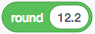

# Documentation For Making a GAN Paint Scratch Block


## Contents
* Introduction
* What is GAN Paint? 
* What is Scratch? 
* How to make Scratch extensions
* The current state of the GAN Paint block
* How to make custom field types
* The blocks playground
* Other notes


## Introduction
Hi, I'm Philip, the UROP who was working on this project during summer 2019. The project is effectively to take [GAN Paint](http://gandissect.res.ibm.com/ganpaint.html?project=churchoutdoor&layer=layer4) and put it in a Scratch block. I got a lot of the work done, but there is still more to do, which I will outline here. I will also explain how to get started making Scratch extensions in the first place, and some other relevant information. If you have any questions about anything, feel free to contact me at my Kerberos email (ptegmark at mit dot-edu), and I'll be happy to help. 

If you are going to work on completing the GAN Paint extension, please go through all sections of this document, with the exception of "How to make custom field types" (for that section, just read up until and including the image that says "This is a field type", which should take you all of 20 seconds). 

If, however, you're only here to learn how to make Scratch extensions, you need only go through the sections "What is Scratch?" and "How to make Scratch extensions". Also go through "How to make custom field types" and "The blocks playground" if you plan on creating your own field type(s) as well. 

Also, a quick grammar note: as you are probably aware, when you follow up something in quotes with a punctuation mark, the English language dictates that the punctuation mark must also be included within the quotation marks, even if said punctuation mark was not part of the quote to begin with. For example, if I wanted to tell you that "orange" was the only word that my friend said, the English language dictates that I write: 

>My friend only said the word "orange." 

with the period included inside the quotation marks, even though the period is not part of what I am actually quoting. 

However, for clarity, I will be disregarding this rule, and keeping all punctuation that is not part of the quote outside of the quotation marks. So, for example, if "field_ganpaint.js" is a file that I want you to open, I will write: 

>Please open "field_matrix.js". 

instead of writing: 

>Please open "field_matrix.js." 

which is what English grammar would dictate that I do. 


## What is GAN Paint? 
[GAN Paint](http://gandissect.res.ibm.com/ganpaint.html?project=churchoutdoor&layer=layer4) is a tool that has used GANs (Generative Adversarial Networks) to generate 16 photorealistic images of churches. By using the various brushes provided, and then dragging your mouse across the image, you can tell GAN Paint to add or remove certain features to/from different parts of the image, and GAN Paint will alter the image accordingly. I recommend that you play around with GAN Paint for a few minutes to see what I'm talking about. 


## What is Scratch? 
I would describe Scratch as a programming language for kids, developed by the Lifelong Kindergarten Group at the MIT Media Lab. It uses blocks instead of lines of code (which is nice because that eliminates syntax errors), and is overall more intuitive to understand than most other programming languages. You can make all sorts of projects in Scratch, and then share them on the [Scratch website](scratch.mit.edu). Scratch can do most of what other programming languages can do, although a Scratch file can only be run inside the Scratch editor. Scratch's other downsides are that it is very slow at math when compared to other programming languages, and that (as far as I am aware) it cannot read from or write to outside files. 

For more information, check out Scratch's About page [here](https://scratch.mit.edu/about). 

Or try using Scratch [here](https://scratch.mit.edu/projects/editor/?tutorial=getStarted). If you have never used Scratch before, I would highly recommend that you play around with it for an hour, and at least learn what the following are: blocks, sprites, costumes/backdrops, and the Stage. Try creating at least one new sprite, write at least 1 script for it, and draw a costume for it. Also try importing an image file from your computer as a new costume, since I think this feature may be of interest down the line for the GAN Paint extension. 

As of when I wrote this, the latest version of Scratch (and the one that we'll be working with) is Scratch 3. Scratch is written primarily in JavaScript, and has both an [online editor](https://scratch.mit.edu/projects/editor/?tutorial=getStarted) and an [offline editor](https://scratch.mit.edu/download/). The repositories for the code to Scratch's online editor are publicly available on GitHub, at [https://github.com/LLK/](https://github.com/LLK/). 

Scratch has various different types of blocks. They are: Motion, Looks, Sound, Events, Control, Sensing, Operators, Variables, and My Blocks. However, you can also load (or make) extensions to Scratch. An extension adds a new set of blocks with their own functionality. For example, the Translate extension lets you use Google Translate to translate text into different languages. To load an extension, click on the "Add Extension" button in the bottom-left corner of the Scratch GUI (by "the Scratch GUI" I mean the Scratch editor). 

Only 11 extensions are officially supported by Scratch, so any extensions you make (unless later incorporated into Scratch by the Scratch team) can only be used on your computer. For more information, see the [Scratch 3 Extensions Documentation](https://github.com/LLK/scratch-vm/blob/develop/docs/extensions.md). 


## How to make Scratch extensions
If you will be working on the GAN Paint extension, read the first half of this section. If you will not be working on the GAN Paint extension, read the second half of this section instead. 

### If you will be working on the GAN Paint extension

First make sure to install Git and npm (Node Package Manager) on your computer, and then download my modified versions of the scratch-gui, scratch-vm, and scratch-blocks repositories from GitHub. Make sure to save all 3 repositories in the same folder. Said repositories can be found here: 

* scratch-gui: [https://github.com/PTegmark/scratch-gui](https://github.com/PTegmark/scratch-gui)
* scratch-vm: [https://github.com/PTegmark/scratch-vm](https://github.com/PTegmark/scratch-vm)
* scratch-blocks: [https://github.com/PTegmark/scratch-blocks](https://github.com/PTegmark/scratch-blocks)

You may or may not also have to download my version of the scratch-render repository, even though I didn't make any important changes to it (all I did was run the commands "npm install" and "npm link" on it). If you wind up getting a scratch-render-related error message when you try loading the Scratch GUI, maybe try also downloading: 

* scratch-render: [https://github.com/PTegmark/scratch-render](https://github.com/PTegmark/scratch-render)

and saving it in the same folder as the other 3 repositories. 

Now, to run my modified version of Scratch, open the terminal, cd into the scratch-gui directory, and enter the command "npm start". Once everything finishes compiling, go to "http://localhost:8601/" in your web browser, and you should see my modified version of Scratch! From there, to load the GAN Paint extension, click on the "Add Extension" button in the bottom left corner of the Scratch GUI, scroll down to the extension labeled "GAN Paint", and click on it. 

If the "npm start" command isn't working, maybe try also downloading my version of the scratch-render repository as described above. If things still don't work after that, then: ask your supervisor for help, try to figure the problem out yourself, and/or see if [this tutorial](https://scratch.mit.edu/discuss/topic/336496/) can help you. 

Whenever you need to rebuild scratch-blocks (i.e. make sure that the changes you make to scratch-blocks get expressed), you will need to open the terminal, cd into the scratch-blocks directory, and enter the command "npm run prepublish". Wait until this has finished executing, then run the command "npm start" within scratch-gui to open the Scratch GUI again. Also, to execute the command "npm run prepublish" in scratch-blocks, you will need to be using Python 2 on your computer. This may require you setting up a virtual environment on your computer to run Python 2. If you don't know how to do this, talk to your supervisor, or try to figure it out yourself. 

Also, make sure to read the [Scratch 3 Extension documentation](https://github.com/LLK/scratch-vm/blob/develop/docs/extensions.md)--it is extremely helpful. 


### If you want to know how to make your own Scratch extensions

To set up everything you need to make Scratch extensions, follow the instructions given in [this tutorial](https://scratch.mit.edu/discuss/topic/336496/). Before you begin the tutorial, however, you will need to make sure that you have both Git and npm (Node Package Manager) installed on your computer. If they are not installed and you need help installing them, consult your supervisor for help, or try to figure it out yourself. Also, in order to be able to use the "npm run prepublish" command listed in step 8 of the tutorial, you will need to be running Python 2 on your computer. This may require you setting up a virtual environment on your computer to run Python 2. If you don't know how to do this, talk to your supervisor, or try to figure it out yourself. <br/><br/>


Once you've successfully completed the tutorial, you can start making extensions! For learning how to do this, absolutely 100% read through the Scratch 3 Extension documentation [here](https://github.com/LLK/scratch-vm/blob/develop/docs/extensions.md). 

If you want, there's also a tutorial on how to make a very basic Scratch extension [here](https://medium.com/@hiroyuki.osaki/how-to-develop-your-own-block-for-scratch-3-0-1b5892026421). It's not the best tutorial though, since the author omits a few steps. If you would like to use this tutorial, keep reading, otherwise, skip ahead to the last paragraph of this section. 

If you do use the tutorial, skip to the section of the tutorial labeled "Method #2. On your development environment". Within this section, skip step 1, since you should have already done that when you completed the previous tutorial. 

Some information that the author of this tutorial omitted: 

* The first 3 code snippets and trees that he shows (namely block3.tree, index.js, and extension-manager.js) are all within the scratch-vm directory. 

* The next 2 code snippets/trees that he shows (namely index.jsx and block7.tree) are within the scratch-gui directory. 

* Add this code: 
```
import newBlockImageURL from './newblocks.png';
import newBlockButtonImageURL from './newblocks-small.png';
```
to the list of import statements at the top of "scratch-gui/src/lib/libraries/extensions/index.jsx". 

* Ignore the next code snippet (block8.sh). In the terminal, cd into the scratch-gui directory, and then type "npm start" (without the quotation marks). 

* In case you're new to JavaScript, all that the function console.log() does is print its argument to the console. It's JavaScript's version of the print statement. <br/><br/>


Alright, provided that you're not planning on making your own field types, you should now be set up to make your own Scratch extensions, and be acquainted with how to do so. If you do need to create your own field types (or if you don't know what "field type" means and would like to know), see the section of this document called "How to make custom field types". 


## The current state of the GAN Paint block
The goal of my project was to make a Scratch block that would let you use the GAN Paint editor inside of Scratch, and then save the image that you created either as a sprite costume or as a background to the Stage. To accomplish this, I downloaded the scratch-gui, scratch-vm, and scratch-blocks repositories from GitHub (as explained in the section "How to make Scratch extensions"), and modified them accordingly. Here are my versions of the repositories that I altered: 

* scratch-gui: [https://github.com/PTegmark/scratch-gui](https://github.com/PTegmark/scratch-gui)
* scratch-vm: [https://github.com/PTegmark/scratch-vm](https://github.com/PTegmark/scratch-vm)
* scratch-blocks: [https://github.com/PTegmark/scratch-blocks](https://github.com/PTegmark/scratch-blocks)

Also, like I mentioned in the "How to make Scratch extensions" section, you might also need to download: 

* scratch-render: [https://github.com/PTegmark/scratch-render](https://github.com/PTegmark/scratch-render)

and save it in the same directory as the other repositories. <br/><br/>

During my time working on the project, I created a new Scratch extension called GAN Paint, which has only 1 block. This block says "save [EDITOR] as a costume" where [EDITOR] is a clickable dropdown that contains the GAN Paint editor. Here's a picture of the block with the dropdown opened: 


And here is a more zoomed-in picture: 


The block's opcode (the opcode is the function that runs when the block gets activated) currently does nothing besides print some stuff to the console (this is not important, and you can remove my "console.log" statement from the opcode with no repercussions). Once completed, however, the block's opcode is supposed to save the GAN Paint editor's main image either as a backdrop of the Stage, or as a costume of the sprite that owns the block. 

The GAN Paint extension's main file is "scratch-vm/src/extensions/scratch3_ganpaint/index.js", while the ganpaint field is controlled by the file "scratch-blocks/core/field_ganpaint.js". 

### What The Block Currently Does: 

* It displays a dropdown GUI for the GAN Paint editor. This dropdown field is of the type "ganpaint", a new field type that I created for this project. 

* The dropdown GUI has: 11 buttons with text on its left hand side (I will inventively refer to these buttons as "text buttons"), the main image that is being edited in the middle, and 16 buttons on the right hand side for selecting which starting church image to use (I will creatively refer to these buttons as "church selection buttons"). 

* The first 7 of the text buttons (labeled "tree" through "dome") are used to select which brush you are using. They act as a set of radio buttons (so that only 1 of the 7 can be selected at any given time). A string called "brushState" records which of the 7 brush buttons is currently selected (see scratch-blocks/core/field_ganpaint.js). 

* The 8th and 9th text buttons (labeled "draw" and "remove", respectively) are for the user to select whether they are adding or removing a given feature from the main image. These two buttons act like radio buttons (so that only one of two can be selected at any given time). A string called "drawingState" records which of these two buttons is currently selected (see scratch-blocks/core/field_ganpaint.js). 

* When clicked, the 11th text button (labeled "reset") resets the main image to display the original version of the image currently being edited. 

* If the user drags the mouse across the main image, the coordinates of all points within the image that the mouse dragged over will be stored in an array called "selectedPoints". selectedPoints is reset every time that the main image is clicked on or dragged. Currently, selectedPoints is simply being printed to the console once the user releases the mouse after dragging it across the main image. However, in the future, releasing the mouse after dragging it across the main image should instead cause selectedPoints to be sent to the GAN Paint server, along with brushState, drawingState, and the current main image. 

* When any given church selection button is clicked, the main image will be set to display the corresponding image. 

### What The Block Still Needs To Do: 

* The 10th text button (labeled "undo"), can be clicked, but currently doesn't do anything besides print the message "Undo button clicked. " to the console. It needs to be properly implemented as an undo button. This undo button will ideally function by storing previous versions of the main image on the user's web browser, and accessing them as necessary when the undo button is clicked. Of course, the actual implementation of the undo button will be up to you (assuming that you are the one who will finish this project). Insert the code that you write for the undo button within the function "Blockly.FieldGANPaint.prototype.onButtonClick" in the file "scratch-blocks/core/field_ganpaint.js", at the spot that says: 

```
// ***
// Undo button NOT YET IMPLEMENTED. Add the necessary code here. 
// ***
```

* The ganpaint field does not yet communicate with the GAN Paint server. Ultimately, the ganpaint field will have to send the main image, along with the information contained in selectedPoints, brushState, and drawingState, to the GAN Paint server whenever the user finishes dragging the mouse across the main image. To help implement this, you will need to add some code to the function "Blockly.FieldGANPaint.prototype.onMouseUp" within the file "scratch-blocks/core/field_ganpaint.js". Add the code at the part of the function where this comment is found:  

```
// ***
// Send this.selectedPoints, this.brushState, this.drawingState, and the main image to the GAN 
// Paint server, and get the new main image back from the server. NOT YET IMPLEMENTED. 
// ***
```

* Continuing off of the previous point, the ganpaint field will also have to get a response from the GAN Paint server. This response should contain the new main image, which the ganpaint field will then display as the new main image. The function "Blockly.FieldGANPaint.prototype.setValue" (in the file "scratch-blocks/core/field_ganpaint.js") might be of use in displaying the image from the GAN Paint server as the new main image, although you will need to modify the function first to make it better suit your needs. 

  Also, once this task is completed, please change the following block comment in the file "scratch-vm/src/extension-support/argument-type.js" so that it more accurately describes what the actual value of the ganpaint field is: 

```
    /**
     * String value with ganpaint field
     */
```

* When activated, the GAN Paint block should (it does not currently do this) save its main image as either a sprite costume or as a Stage backdrop. To accomplish this, you will need to add code to the GAN Paint block's opcode (i.e. the function "saveGANPaintImage" within the file "scratch-vm/src/extensions/scratch3_ganpaint/index.js"). Scratch does let its users import external images to be used as a costumes--if you can figure out what JavaScript function it is that does this, you can probably use that function to save the main GAN Paint image as a costume or backdrop. I don't know what function it is though, so you'll have to find it. Or save the main GAN Paint image in some other way. Also, feel free to disregard my commented-out code in the saveGANPaintImage function in the file "scratch-vm/src/extensions/scratch3_ganpaint/index.js". 

* The SVG images that I have used to create the GAN Paint field don't display properly in Safari. In Safari, you just get this instead: 


This needs to be fixed. You will need the GAN Paint extension to function properly in Firefox, Chrome, Safari, and Microsoft Edge (and possibly also in Internet Explorer and Opera--ask whoever is in charge (presumably your supervisor) about what browsers the GAN Paint extension needs to function properly in). Right now, the SVG images in question do display properly in Firefox though, I can guarantee that much. 

I have not tested the GAN Paint extension in Chrome, Microsoft Edge, Internet Explorer, or Opera, so I don't know how well the extension currently works in those browsers. 

* On the [GAN Paint website](http://gandissect.res.ibm.com/ganpaint.html?project=churchoutdoor&layer=layer4), the main image gets visibly shaded as the user drags their mouse over it. Currently, however, the ganpaint field in Scratch does not do so. So, if you have time, this shading feature should be implemented in the ganpaint field. To accomplish this, you will probably need to add code to the functions "Blockly.FieldGANPaint.prototype.onMouseDown" and "Blockly.FieldGANPaint.prototype.onMouseMove" in the file "scratch-blocks/core/field-ganpaint.js". 

* The images that the GAN Paint extension currently uses in the extension library (i.e. the pictures that you see when you click the "Add Extension" button in the Scratch GUI) are the same as the pictures used in [this tutorial](https://medium.com/@hiroyuki.osaki/how-to-develop-your-own-block-for-scratch-3-0-1b5892026421). Eventually, these pictures will need to be replaced with other, more suitable images. Replacing these images will involve replacing the two images stored in the folder "scratch-gui/src/lib/libraries/extensions/ganpaint", and modifying the file "scratch-gui/src/lib/libraries/extensions/index.jsx" accordingly. 

* OPTIONAL: Depending on the circumstances for which it is to be used, the GAN Paint extension might eventually need to be viewable in other languages. This, however, is completely optional at this point, as it is not at all an immediate concern. 

Please read the section of this document called "The blocks playground" before you start making alterations to scratch-blocks/core/field_ganpaint.js, as using the blocks playground will save you a lot of time. 

Good luck! And feel free to contact me if you have any questions (especially if I explained something poorly and/or forgot to mention something important). 


## How to make custom field types

First off, what is a field in Scratch? A field (sometimes called an argument) refers to an input field on a Scratch block, like this: 


There are many different field types, from text fields to dropdown menus to angle pickers. As of when I wrote this document, Scratch supports the following field types (although it is not impossible that it also supports other field types of which I am not aware): 

* Angle: 


* Boolean: 


* Color: 


* Number: 



* String: 


* Matrix: 


* Note: 


* Dropdown Menu: 


This list of field types (not including the dropdown menu) can also be found in the file "scratch-vm/src/extension-support/argument-type.js". 

As of when I write this, there is no support for creating custom field types using Scratch extensions. So, if you can implement your Scratch extension without creating any additional fields, that would be for the best. 

But what if you do need to create your own field type? How can you do that? I will provide you with the list of steps that I followed to set up my GAN Paint field as a new field type. Assuming that I haven't forgotten about anything important, you should be able to repeat these steps yourself to set up your own custom field type. If my instructions do not work, consider meeting with someone from the Scratch team to get help, if that option is open to you. 

### The steps I followed to implement a new "ganpaint" field type

1. I made a copy of the file "scratch-blocks/core/field_matrix.js". I named said copy "field_ganpaint.js", and saved it in the directory "scratch-blocks/core". 

2. "scratch-blocks/core/field_matrix.js" uses the namespace "Blockly.FieldMatrix". To ensure that "scratch-blocks/core/field_ganpaint.js" uses its own unique namespace, I replaced every appearance of the text "Blockly.FieldMatrix" in the file "scratch-blocks/core/field_ganpaint.js" with the text "Blockly.FieldGANPaint". 

3. I changed the line at the end of "scratch-blocks/core/field_matrix.js", which previously read: 

`Blockly.Field.register('field_matrix', Blockly.FieldMatrix);`

so that it instead reads: 

`Blockly.Field.register('field_ganpaint', Blockly.FieldGANPaint);`

4. I added the following code at the end of the file "scratch-blocks/blocks_common/matrix.js": 

```
Blockly.Blocks['ganpaint'] = {
  /**
   * Block for ganpaint value.
   * @this Blockly.Block
   */
  init: function() {
    this.jsonInit({
      "message0": "%1",
      "args0": [
        {
          "type": "field_ganpaint",
          "name": "GANPAINT"
        }
      ],
      "outputShape": Blockly.OUTPUT_SHAPE_ROUND,
      "output": "Number",
      "extensions": ["colours_pen"]
    });
  }
};
```

5. I added the line

`goog.require('Blockly.FieldGANPaint');`

to the list of goog.require() statements at the top of the file "scratch-blocks/core/blockly.js". 

6. OPTIONAL BUT RECOMMENDED: If you would like to use the blocks playground to work on your field type (this will save you a lot of time; see the section of this document entitled "The blocks playground" for more information), you will also need to register your field as part of a block within the blocks playground. To do so for the ganpaint field type, I made changes to the files "scratch-blocks/blocks_vertical/default_toolbox.js" and to "scratch-blocks/blocks_vertical/extensions.js", as can be seen here: [https://github.com/PTegmark/scratch-blocks/commit/3aa5429b884c49426b8f7c9bcd9120f0e7de0018](https://github.com/PTegmark/scratch-blocks/commit/3aa5429b884c49426b8f7c9bcd9120f0e7de0018). 

Or, should you however have trouble viewing my changes using that link, here is a written description of what I did: 

First, I added the following lines to "scratch-blocks/blocks_vertical/default_toolbox.js": 

```
    '<block type="extension_ganpaint" id="extension_ganpaint">' +
      '<value name="GANPAINT">' +
        '<shadow type="ganpaint">' +
          '<field name="GANPAINT"></field>' +
        '</shadow>' +
      '</value>' +
    '</block>' +
```

I added said code at line 544 of the document, so that the resulting nearby code looked like this: 

```
      '</value>' +
    '</block>' +
    '<block type="extension_music_reporter" id="extension_music_reporter"></block>' +
    
    '<block type="extension_ganpaint" id="extension_ganpaint">' +
      '<value name="GANPAINT">' +
        '<shadow type="ganpaint">' +
          '<field name="GANPAINT"></field>' +
        '</shadow>' +
      '</value>' +
    '</block>' +

    '<block type="extension_microbit_display" id="extension_microbit_display">' +
      '<value name="MATRIX">' +
        '<shadow type="matrix">' +
```

And secondly, I added the following declaration at the end of the file "scratch-blocks/blocks_vertical/extensions.js": 

```
Blockly.Blocks['extension_ganpaint'] = {
  /**
   * @this Blockly.Block
   */
  init: function() {
    this.jsonInit({
      "message0": "%1 %2 display %3",
      "args0": [
        {
          "type": "field_image",
          "src": Blockly.mainWorkspace.options.pathToMedia + "extensions/microbit-block-icon.svg",
          "width": 40,
          "height": 40
        },
        {
          "type": "field_vertical_separator"
        },
        {
          "type": "input_value",
          "name": "GANPAINT"
        },
      ],
      "category": Blockly.Categories.pen,
      "extensions": ["colours_pen", "shape_statement", "scratch_extension"]
    });
  }
};
```

7. I opened "scratch-vm/src/extension-support/argument-type.js", and added the new attribute “GANPAINT” to the ArgumentType object, assigning to my new attribute a value of “ganpaint”. After finishing this step, the file "scratch-vm/src/extension-support/argument-type.js" looked like this: 

```
/**
 * Block argument types
 * @enum {string}
 */
const ArgumentType = {
    /**
     * Numeric value with angle picker
     */
    ANGLE: 'angle',

    /**
     * Boolean value with hexagonal placeholder
     */
    BOOLEAN: 'Boolean',

    /**
     * Numeric value with color picker
     */
    COLOR: 'color',

    /**
     * Numeric value with text field
     */
    NUMBER: 'number',

    /**
     * String value with text field
     */
    STRING: 'string',

    /**
     * String value with matrix field
     */
    MATRIX: 'matrix',

    /**
     * String value with ganpaint field
     */
    GANPAINT: 'ganpaint',

    /**
     * MIDI note number with note picker (piano) field
     */
    NOTE: 'note'
};

module.exports = ArgumentType;
```

8. I opened "scratch-vm/src/engine/runtime.js", where I added the following declaration to the declaration of the const ArgumentTypeMap: 

```
map[ArgumentType.GANPAINT] = {
        shadowType: 'ganpaint',
        fieldType: 'GANPAINT'
    };
```

After completing this step, ArgumentTypeMap’s declaration in "scratch-vm/src/engine/runtime.js" looked like this: 

```
/**
 * Information used for converting Scratch argument types into scratch-blocks data.
 * @type {object.<ArgumentType, {shadowType: string, fieldType: string}>}
 */
const ArgumentTypeMap = (() => {
    const map = {};
    map[ArgumentType.ANGLE] = {
        shadowType: 'math_angle',
        fieldType: 'NUM'
    };
    map[ArgumentType.COLOR] = {
        shadowType: 'colour_picker'
    };
    map[ArgumentType.NUMBER] = {
        shadowType: 'math_number',
        fieldType: 'NUM'
    };
    map[ArgumentType.STRING] = {
        shadowType: 'text',
        fieldType: 'TEXT'
    };
    map[ArgumentType.BOOLEAN] = {
        check: 'Boolean'
    };
    map[ArgumentType.MATRIX] = {
        shadowType: 'matrix',
        fieldType: 'MATRIX'
    };
    map[ArgumentType.GANPAINT] = {
        shadowType: 'ganpaint',
        fieldType: 'GANPAINT'
    };
    map[ArgumentType.NOTE] = {
        shadowType: 'note',
        fieldType: 'NOTE'
    };
    return map;
})();
```

9. To use my new field type, I opened my extension's index.js file (scratch-vm/src/extensions/scratch3_ganpaint/index.js), and created a new block that used the ganpaint argument. Here is an abbreviated version of my index.js file after completing this step: 

```
// [IMPORT STATEMENTS HERE]


/**
 * Class for the GAN Paint block in Scratch 3.0. 
 */
class Scratch3GANPaintBlocks {


    // [OTHER STUFF HERE]


    /**
     * @returns {object} metadata for this extension and its blocks.
     */
    getInfo () {
        return {
            id: Scratch3GANPaintBlocks.EXTENSION_ID,
            name: Scratch3GANPaintBlocks.EXTENSION_NAME,
            showStatusButton: true,
            blocks: [
                {
                    opcode: 'saveGANPaintImage',
                    text: formatMessage({
                        id: 'ganpaint.saveGANPaintImage',
                        default: 'save [EDITOR] as a costume',
                        description: 'edit your image with the GAN Paint editor, and then save the image as a costume'
                    }),
                    blockType: BlockType.COMMAND,
                    arguments: {
                        EDITOR: {
                            type: ArgumentType.GANPAINT
                        }
                    }
                }
            ]
        };
    }

    /**
     * Eventually is supposed to save the GAN Paint editor's image as a costume. Currently it does not do so. 
     * @param {object} args - the block's arguments. 
     */
    saveGANPaintImage (args) {
        console.log(args);
    }

}

module.exports = Scratch3GANPaintBlocks;
```

10. And of course, I altered the contents of my "scratch-blocks/core/field_ganpaint.js" file to make my new ganpaint field type suit my needs. 

11. Assuming that I didn't forget anything (my apologies if I did), those were all of the necessary steps it took for me to create my new ganpaint field type! Hopefully you can follow the same steps to create a field type of your own should you need one. 


## The blocks playground

As you may remember from [this tutorial](https://scratch.mit.edu/discuss/topic/336496/) from the section "How to make Scratch extensions", if you make a change to the scratch-blocks directory and want that change to be reflected in the Scratch GUI, you'll need to: 

* 1: Open the terminal, cd into the scratch-blocks directory, and run the command "npm run prepublish" (side note: for this command to work properly, you'll need to be running Python 2 on your computer). 
* 2: Once the "npm run prepublish" command has finished executing, cd into the scratch-gui directory, and run the command "npm start". 

Now, running these two commands typically takes me about 3 minutes to do on my laptop, which can be a pretty long time to have to wait. But thankfully, there is another, faster way to see the effect of your changes to scratch-blocks: using the blocks playground. To access the blocks playground, just open the file "scratch-blocks/tests/vertical_playground.html" in your web browser. You should see this: 


The blocks playground loads only Scratch's blocks and nothing else, which lets you test the changes you've made to scratch-blocks without having to wait for "npm run prepublish" and "scratch-gui" to run. If you're working on the GAN Paint extension, a GAN Paint block is already included for you to use. If you need to add your own new block to the blocks playground, or if you need to modify an existing block in the blocks playground, you'll need to make changes to the files "scratch-blocks/blocks_vertical/default_toolbox.js" and/or "scratch-blocks/blocks_vertical/extensions.js". For more information, see step 6 of the list of steps for implementing the ganpaint field type in the section "How to make custom field types". 


## Other notes

### A list of potentially useful hyperlinks from previous sections: 

* GAN Paint: [http://gandissect.res.ibm.com/ganpaint.html?project=churchoutdoor&layer=layer4](http://gandissect.res.ibm.com/ganpaint.html?project=churchoutdoor&layer=layer4)
* Scratch Website: [scratch.mit.edu](scratch.mit.edu)
* Scratch Online Editor GitHub Repositories: [https://github.com/LLK/](https://github.com/LLK/)
* Scratch 3 Extensions Documentation: [https://github.com/LLK/scratch-vm/blob/develop/docs/extensions.md](https://github.com/LLK/scratch-vm/blob/develop/docs/extensions.md)
* Tutorial for Scratch Extension Set-Up: [https://scratch.mit.edu/discuss/topic/336496/](https://scratch.mit.edu/discuss/topic/336496/)
* Tutorial on how to make a very basic Scratch extension (has some issues): [https://medium.com/@hiroyuki.osaki/how-to-develop-your-own-block-for-scratch-3-0-1b5892026421](https://medium.com/@hiroyuki.osaki/how-to-develop-your-own-block-for-scratch-3-0-1b5892026421)

My modified versions of the scratch-gui, scratch-vm, scratch-blocks, and scratch-render repositories: 

* scratch-gui: [https://github.com/PTegmark/scratch-gui](https://github.com/PTegmark/scratch-gui)
* scratch-vm: [https://github.com/PTegmark/scratch-vm](https://github.com/PTegmark/scratch-vm)
* scratch-blocks: [https://github.com/PTegmark/scratch-blocks](https://github.com/PTegmark/scratch-blocks)
* scratch-render: [https://github.com/PTegmark/scratch-render](https://github.com/PTegmark/scratch-render)


### Other helpful resources and tools: 

* Your supervisor! 
* Me (well, I hope I'm helpful, anyway)! Feel free to contact me if you need help or clarity regarding something that I have done. See the "Introduction" section for my contact information. 
* [MDN Web Docs](https://developer.mozilla.org/en-US/) and [W3Schools](https://www.w3schools.com/) are both very helpful resources with a lot of useful information about everything web development-related. Of these two, W3Schools' explanations tend to require a little bit less knowledge to understand. But if it's an in-depth answer that you need, MDN Web Docs is the way to go. 
* [Stack Overflow](https://stackoverflow.com/) and other online forums! 
* Search engines! I would recommend entering your query into your search engine, and then keeping an eye out for Stack Overflow, MDN Web Docs, and W3Schools links in the search results. 
* [Inspect Element! ](https://www.lifewire.com/get-inspect-element-tool-for-browser-756549)
* [Print statements! ](https://developer.mozilla.org/en-US/docs/Web/API/Console/log)
* For a list of the different Scratch block types, see the file "scratch-vm/src/extension-support/block-type.js". For a list of most (this list doesn't include dropdown menus) of the different Scratch field types, see the file "scratch-vm/src/extension-support/argument-type.js". 
* If you've never used the terminal before, I would recommend learning the following commands and things: 
  * cd (change working directory)
  * ls (list the items in a directory)
  * ls -a (list ALL the items in a directory)
  * pwd (print working directory)
  * "." (a single period) refers to the working directory. So "cd folder-name" does the same thing as "cd ./folder-name". 
  * ".." (two periods) refers to the parent directory. So if your working directory is "/Users/username/folder1/folder2", entering the command "cd .." into the terminal would change your working directory to "/Users/username/folder1". 


TODO: 

add links to contents that link to each section
